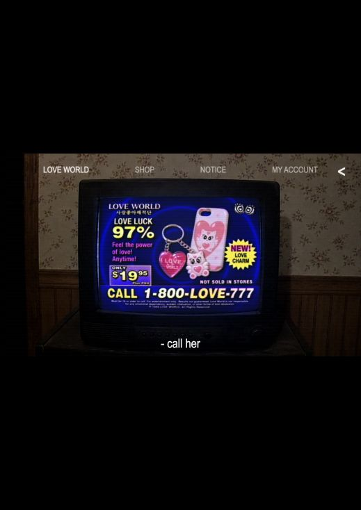
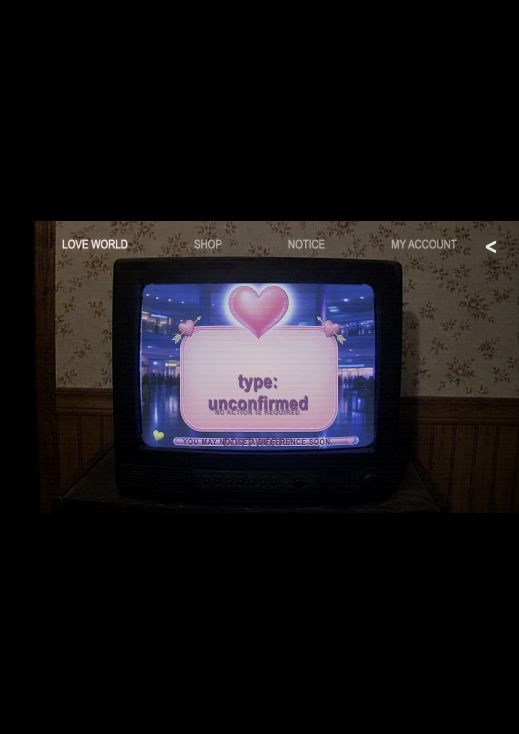
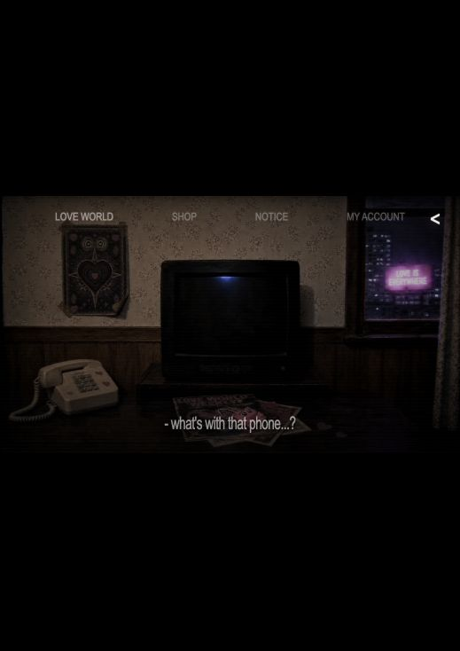
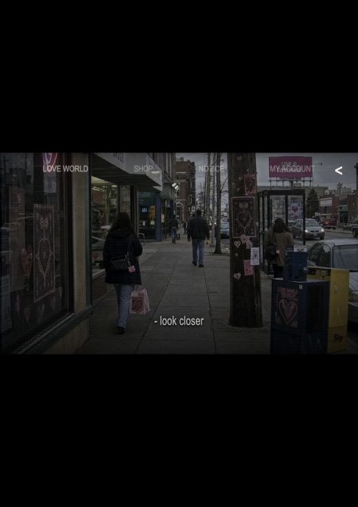
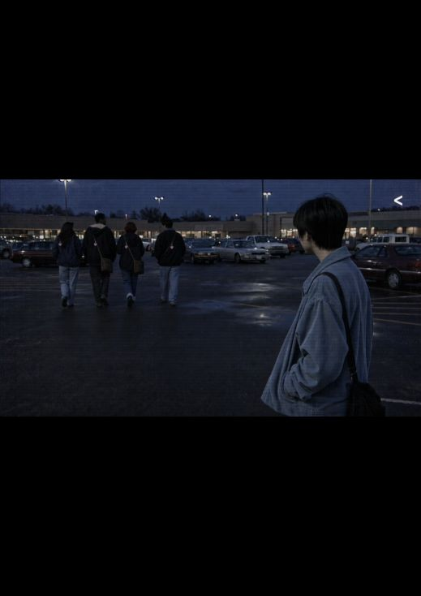
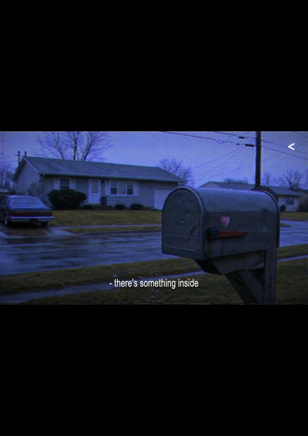
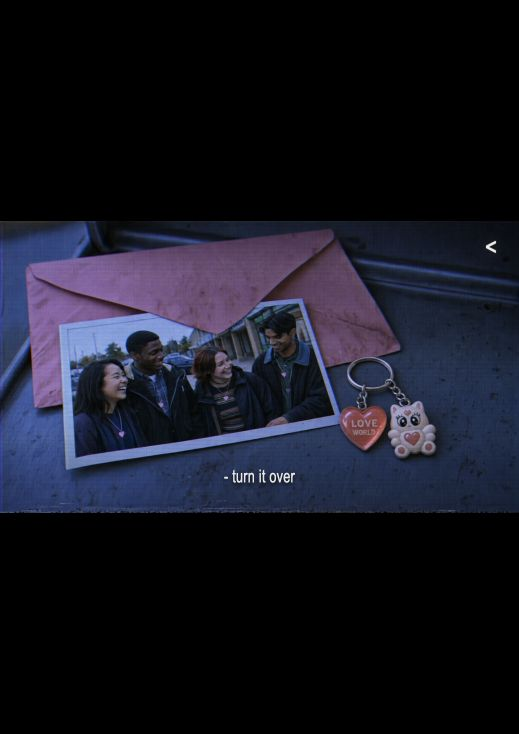
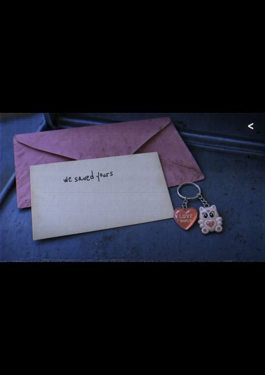
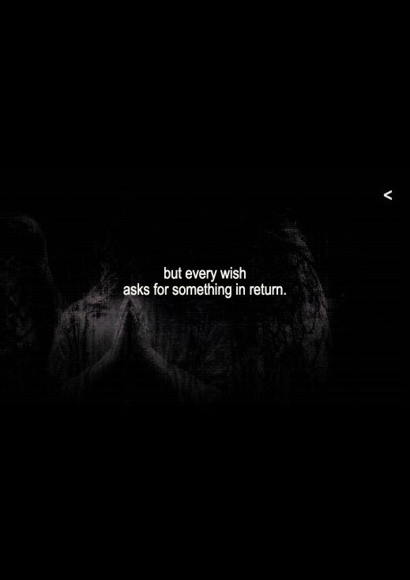

# LOVE WORLD 설화형 서사 감사

## 감사 범위

- 대상: 방송 광고부터 `but every wish asks for something in return.`까지의 현재 공개 흐름
- 기준: `해적단_세계관_바이블.md`의 소녀 신화, 유행의 점진적 강요, 반복 상징, 아카이브 반전 지연 원칙
- 목표: 여러 미디어 장면이 하나의 차분하고 서늘한 설화처럼 이어지는가

## 총평

현재 사이트에는 설화가 될 재료가 이미 강하게 있다. 소녀의 소원, 세 번 돌아오는 부적, 무리에서 떨어진 인물, 길가의 우체통, 주인을 기다리던 물건, 소원의 대가가 모두 정확한 상징이다. 특히 우체통부터 마지막 문장까지는 작은 물건 하나가 운명처럼 돌아오는 설화의 감각이 살아 있다.

문제는 재료가 아니라 문법이다. 현재 중간부는 `광고 → 검사 결과 → 방 탈출형 탐색 → 도시 관찰 → 공익광고 → 우체통`처럼 인터페이스와 장르가 자주 바뀐다. 그래서 한 이야기가 흘러간다기보다 잘 만든 ARG 장면 여러 개를 구경하는 느낌이 앞선다.

설화형으로 만들려면 광고와 뉴스 자체를 없앨 필요는 없다. 대신 모든 장면 위에 하나의 단순한 인과를 세워야 한다.

```text
소녀가 소원을 빌었다
→ 세상이 그 소원을 상품으로 받아들였다
→ 부적을 단 사람들끼리 무리가 생겼다
→ 달지 않은 사람은 혼자 남았다
→ 어느 날 그 사람의 몫이 우체통에 도착했다
→ 소원은 대가를 요구했다
```

## 흐름별 평가

### 1. LOVE CHARM 광고 — 건강하지만 설화의 바깥에 있음



광고는 세계관 바이블의 `귀여움이 먼저 작동해야 한다`는 원칙에 잘 맞는다. 부적이 설화의 마법 물건 역할도 한다. 다만 현재는 광고가 단독 코미디처럼 보여 프롤로그의 소원과 인과가 없다. 광고 직전 또는 직후에 `and the world answered her.` 같은 짧은 서술 한 줄이 있으면, 상품이 소원의 변형이라는 의미가 생긴다.

### 2. `type: unconfirmed` — 구조적으로 가장 약한 장면



이 장면은 설화보다 성격 테스트·게임 결과 화면에 가깝다. 또한 실제 사용자와 가상의 시민 분류를 분리한다는 바이블 원칙을 흐린다. 초반에 분류 시스템을 직접 보여줘 강요 단계도 너무 빨리 누설한다. 이번 장에서는 제거하거나, 훨씬 후반의 가상 시민 기록 장면으로 이동하는 것이 좋다.

### 3. TV가 꺼진 방 — 좋은 경계 장면, 문장이 너무 일상적임



TV가 현실을 침범한 뒤 전화기만 남는 구성은 매우 좋다. 방송 세계에서 현실 세계로 건너가는 문턱이다. 다만 `what's with that phone...?`은 등장인물의 즉흥 반응이라 설화의 차분한 목소리가 끊긴다. `after the broadcast ended, the ringing remained.`처럼 사건을 담담하게 서술하면 한 편의 이야기로 묶인다.

상단의 `SHOP / NOTICE / MY ACCOUNT`가 영상 위에 계속 남는 것도 몰입을 끊는다. 실제 판매·가입 기능은 유지하되, 서사 재생 중에는 숨기고 장면 밖에서만 다시 보여주는 편이 좋다.

### 4. 도시와 친구들 — 상징은 좋지만 탐색 게임처럼 보임





도시 곳곳의 같은 부적, 무리에서 떨어져 그들을 바라보는 인물은 설화의 핵심 장면이 될 수 있다. 하지만 `look closer`와 화면 전환은 단서를 찾는 게임처럼 느껴진다. 이 구간은 `by morning, everyone was wearing one.`처럼 시간과 결과를 말하는 한 줄이 먼저 나오고, 사용자는 그 결과를 목격하기만 하는 편이 낫다.

`everyone belongs in love`와 `non-lovers will be corrected`는 교단의 선전 문구로는 맞지만, 둘을 연속으로 크게 보여주면 공포의 뜻을 너무 직접 해설한다. 첫 문장만 광고의 잔향처럼 남기고, 두 번째 뜻은 친구들이 떠나는 행동으로 보여주는 것이 더 서늘하다.

### 5. 우체통 — 현재 흐름에서 가장 설화적임



평범한 길가의 우체통은 현실과 다른 세계가 만나는 문턱이다. 집 앞에 놓인 정체불명의 물건이라는 점도 좋다. 다만 `there's something inside`는 게임 안내문처럼 들린다. `one morning, something was waiting at the gate.`처럼 시간과 장소를 가진 문장으로 바꾸면 설화의 사건이 된다.

### 6. 사진·부적·메모 — 가장 강한 반복 상징





TV 광고에서 본 부적이 현실의 우체통 안에 돌아오는 순간은 현재 사이트에서 가장 성공적이다. 광고 상품이 `마법의 증표`로 의미가 바뀐다. 사진, 부적, 손글씨도 설명보다 물증으로 이야기한다는 바이블 원칙과 잘 맞는다.

다만 `turn it over`는 서사 문장과 조작 안내가 섞여 있다. 조작 표시는 작은 화살표나 클릭 표시로 분리하고, 이야기 문장은 `on the back, someone had written—`처럼 유지하는 편이 좋다. `we saved yours`는 손글씨 물증으로 그대로 남겨도 좋다.

### 7. 소원의 대가 — 설화의 결말로 매우 강함



`but every wish asks for something in return.`은 앞의 소녀 신화와 현재 사건을 다시 연결하는 가장 좋은 문장이다. 문제는 이 문장이 나오기 전까지 프롤로그의 소원이 오래 사라져 있다는 점이다. 광고 앞, 도시 앞, 우체통 앞에 각각 한 줄씩 신화적 서술을 배치하면 마지막 문장이 갑자기 멋있는 문구가 아니라 필연적인 결말이 된다.

현재 자막 크기는 이미지 질감에 비해 작다. 약 12–15% 키우되 굵기와 문장 수는 늘리지 않는 것이 좋다.

## 설화형으로 바꾸는 핵심 원칙

1. **하나의 목소리를 세운다.** 프롤로그와 같은 차분한 서술자가 장면 사이만 연결한다. 광고·뉴스·통화는 세계 안의 목소리로 남긴다.
2. **부적을 세 번 반복한다.** TV 광고의 상품 → 거리와 친구들의 소속 표식 → 우체통에 도착한 주인공의 몫. 이 세 번이면 별도 설명 없이 운명처럼 느껴진다.
3. **클릭 안내와 이야기 문장을 분리한다.** `look closer`, `turn it over`, `there's something inside`를 서사 자막으로 쓰지 않는다.
4. **결과 화면을 제거한다.** `type: unconfirmed`는 현재 장의 설화와 사용자 위치를 모두 흐린다.
5. **상단 메뉴는 영화가 재생될 때 숨긴다.** 실제 쇼핑과 계정 기능은 장면 밖의 현실 UI로 남긴다.
6. **강요를 말보다 행동으로 보여준다.** `non-lovers will be corrected`를 크게 설명하기보다 친구들이 떠나고, 주인공의 몫이 우체통에 도착하게 한다.
7. **장면 사이에 상대적 시간을 둔다.** `that night`, `by morning`, `on the third day` 같은 표현은 몽타주를 하나의 옛이야기로 묶는다.

## 권장 서사 골격

```text
once, a girl wished for everyone to fall in love.

and the world answered her.

by morning, everyone was wearing one.

those who wore it stayed together.

one evening, something was waiting at the gate.

inside was the place they had saved for her.

but every wish asks for something in return.
```

이 문장들을 모두 검은 화면에 따로 띄울 필요는 없다. 기존 광고·도시·우체통 이미지 위에 장면당 한 줄만 두면 된다. 핵심은 문체를 화려하게 만드는 것이 아니라, 원인과 결과를 단순하게 만드는 것이다.

## 접근성 및 사용성 위험

- 현재 자막은 작은 화면에서 읽기 작고, 영상 질감과 겹칠 때 대비가 흔들린다.
- 상단 메뉴는 이미지에 따라 대비가 크게 바뀌고 서사 중 오클릭 가능성이 있다.
- 숨겨진 여러 단계의 버튼과 문장이 접근성 트리에 한꺼번에 남아 있어, 화면 읽기 도구가 현재 장면만 순서대로 읽지 못할 위험이 있다.
- 뒤로 가기 버튼은 접근성 이름 `Go back`이 있어 긍정적이지만, 시각적으로는 작은 `<` 하나라 의미와 클릭 영역이 충분한지 실제 키보드·확대 테스트가 필요하다.

## 확인 한계

현재 `preview=propaganda` 모드에서는 프롤로그와 교리 화면이 숨겨져 있어 이번 캡처에서 유효한 스크린샷을 얻지 못했다. 따라서 프롤로그의 시각·타이밍 자체는 평가하지 않았고, 방송 이후부터 마지막 문장까지를 중심으로 판단했다. 키보드 포커스, 스크린 리더 낭독 순서, 모션 감소 설정은 스크린샷만으로 확정할 수 없다.
